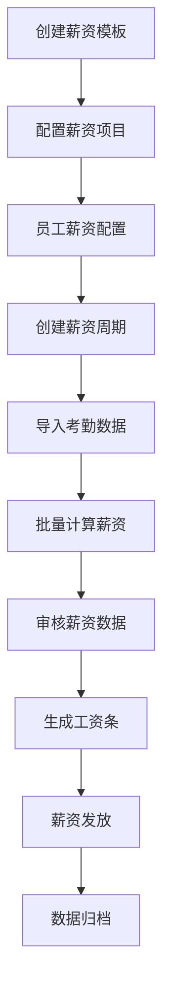

# 人事工资管理系统重构设计文档

## 1. 现状分析

### 1.1 当前系统存在的问题

#### 1.1.1 架构层面问题
- **模型关系复杂且不清晰**：模型之间的关系定义不明确，导致查询时出现`prefetch_related`参数错误
- **职责边界模糊**：多个模型承担相似功能，如`SalaryStructure`和`EmployeeSalary`职责重叠
- **业务逻辑分散**：薪资计算逻辑分散在视图层、模型层和服务层，难以维护

#### 1.1.2 数据层面问题
- **字段命名不一致**：如`tax`和`income_tax`字段混用，造成查询错误
- **数据冗余**：相同信息在多个表中重复存储
- **缺乏数据完整性约束**：关键业务数据缺乏必要的约束条件

#### 1.1.3 API层面问题
- **响应格式不统一**：部分API将数据错误地放在`message`字段而非`data`字段
- **错误处理不完善**：缺乏统一的错误处理机制
- **缺乏版本控制**：API没有版本管理，难以向后兼容

#### 1.1.4 业务层面问题
- **功能耦合度高**：薪资计算、税收计算、报表生成等功能相互耦合
- **扩展性差**：难以支持新的薪资项目类型或计算规则
- **缺乏审计功能**：无法追踪薪资数据的变更历史

## 2. 设计目标与原则

### 2.1 设计目标

#### 2.1.1 业务目标
- **简单易用**：为中小型企业提供简洁直观的薪资管理界面
- **功能完整**：覆盖薪资管理的完整业务流程
- **灵活配置**：支持不同企业的薪资结构和计算规则
- **数据准确**：确保薪资计算的准确性和一致性

#### 2.1.2 技术目标
- **架构清晰**：模块化设计，职责分明
- **易于维护**：代码结构清晰，便于后续维护和扩展
- **性能优良**：支持大量员工数据的高效处理
- **安全可靠**：保障薪资数据的安全性和系统稳定性

### 2.2 设计原则

#### 2.2.1 单一职责原则
每个模型、服务类只负责一个明确的业务概念，避免职责混乱

#### 2.2.2 开闭原则
系统对扩展开放，对修改封闭，支持新功能的添加而不影响现有功能

#### 2.2.3 依赖倒置原则
高层模块不依赖低层模块，都依赖于抽象接口

#### 2.2.4 数据一致性原则
统一的字段命名、数据格式和业务规则

#### 2.2.5 可测试性原则
代码结构支持单元测试和集成测试

## 3. 系统架构设计

### 3.1 整体架构

```
┌─────────────────┐    ┌─────────────────┐    ┌─────────────────┐
│   前端界面层     │    │    API网关层     │    │   业务服务层     │
│  (Vue.js/React) │◄──►│   (Django REST)  │◄──►│  (Service Layer) │
└─────────────────┘    └─────────────────┘    └─────────────────┘
                                                        │
                        ┌─────────────────┐    ┌─────────────────┐
                        │   数据访问层     │    │   数据持久层     │
                        │ (Django ORM)    │◄──►│   (PostgreSQL)   │
                        └─────────────────┘    └─────────────────┘
```

### 3.2 分层职责

#### 3.2.1 前端界面层
- 用户交互界面
- 数据展示和表单处理
- 前端数据验证
- 用户体验优化

#### 3.2.2 API网关层
- 请求路由和分发
- 统一的响应格式
- 权限验证和访问控制
- 请求日志记录

#### 3.2.3 业务服务层
- 核心业务逻辑处理
- 薪资计算引擎
- 数据验证和转换
- 事务管理

#### 3.2.4 数据访问层
- 数据库操作封装
- 查询优化
- 缓存管理
- 数据映射

#### 3.2.5 数据持久层
- 数据存储
- 数据完整性约束
- 备份和恢复
- 性能优化

## 4. 数据模型设计

### 4.1 核心模型概览

```
SalaryTemplate (薪资模板)
    ├── SalaryItem (薪资项目)
    └── EmployeeSalaryConfig (员工薪资配置)
            └── SalaryRecord (薪资记录)
                    └── SalaryRecordItem (薪资记录明细)

TaxRule (税收规则)
    └── TaxBracket (税率档次)

SalaryPeriod (薪资周期)
    └── SalaryRecord (薪资记录)
```

### 4.2 详细模型设计（基于现有结构重构）

#### 4.2.1 薪资模板 (SalaryTemplate) - 重构现有SalaryStructure
```python
# 在现有 salary/models.py 中重构
class SalaryTemplate(models.Model):
    """薪资结构模板 - 重构自原SalaryStructure"""
    name = models.CharField(max_length=100, verbose_name="模板名称")
    description = models.TextField(blank=True, verbose_name="模板描述")
    is_active = models.BooleanField(default=True, verbose_name="是否启用")
    created_at = models.DateTimeField(auto_now_add=True)
    updated_at = models.DateTimeField(auto_now=True)
    
    class Meta:
        db_table = 'salary_template'  # 可通过migration从原表迁移
        verbose_name = '薪资模板'
        verbose_name_plural = '薪资模板'
    
    def __str__(self):
        return self.name
```

#### 4.2.2 薪资项目 (SalaryItem) - 重构现有SalaryComponent
```python
# 在现有 salary/models.py 中重构
class SalaryItem(models.Model):
    """薪资项目定义 - 重构自原SalaryComponent"""
    ITEM_TYPE_CHOICES = [
        ('basic', '基本工资'),
        ('performance', '绩效工资'),
        ('allowance', '津贴补贴'),
        ('bonus', '奖金'),
        ('deduction', '扣除项'),
        ('tax', '个人所得税'),
        ('social_insurance', '社会保险'),
    ]
    
    CALCULATION_TYPE_CHOICES = [
        ('fixed', '固定金额'),
        ('percentage', '百分比'),
        ('formula', '公式计算'),
        ('attendance', '考勤相关'),
    ]
    
    template = models.ForeignKey(SalaryTemplate, on_delete=models.CASCADE, related_name='items')
    name = models.CharField(max_length=100, verbose_name="项目名称")
    code = models.CharField(max_length=50, verbose_name="项目代码")
    item_type = models.CharField(max_length=20, choices=ITEM_TYPE_CHOICES, verbose_name="项目类型")
    calculation_type = models.CharField(max_length=20, choices=CALCULATION_TYPE_CHOICES, verbose_name="计算方式")
    is_taxable = models.BooleanField(default=True, verbose_name="是否计税")
    sort_order = models.IntegerField(default=0, verbose_name="排序")
    is_active = models.BooleanField(default=True, verbose_name="是否启用")
    
    class Meta:
        db_table = 'salary_item'
        unique_together = ['template', 'code']
        ordering = ['sort_order', 'name']
    
    def __str__(self):
        return f"{self.template.name} - {self.name}"
```

#### 4.2.3 员工薪资配置 (EmployeeSalaryConfig) - 重构现有EmployeeSalary
```python
# 在现有 salary/models.py 中重构
class EmployeeSalaryConfig(models.Model):
    """员工薪资配置 - 重构自原EmployeeSalary"""
    employee = models.OneToOneField('personal.Personal', on_delete=models.CASCADE, related_name='salary_config')
    template = models.ForeignKey(SalaryTemplate, on_delete=models.PROTECT, verbose_name="薪资模板")
    effective_date = models.DateField(verbose_name="生效日期")
    is_active = models.BooleanField(default=True, verbose_name="是否启用")
    created_at = models.DateTimeField(auto_now_add=True)
    updated_at = models.DateTimeField(auto_now=True)
    
    class Meta:
        db_table = 'employee_salary_config'
        verbose_name = '员工薪资配置'
        verbose_name_plural = '员工薪资配置'
    
    def __str__(self):
        return f"{self.employee.name} - {self.template.name}"
```

#### 4.2.4 员工薪资项目配置 (EmployeeSalaryItemConfig)
```python
class EmployeeSalaryItemConfig(models.Model):
    """员工具体薪资项目配置"""
    salary_config = models.ForeignKey(EmployeeSalaryConfig, on_delete=models.CASCADE, related_name='item_configs')
    salary_item = models.ForeignKey(SalaryItem, on_delete=models.CASCADE)
    fixed_amount = models.DecimalField(max_digits=10, decimal_places=2, null=True, blank=True, verbose_name="固定金额")
    percentage_value = models.DecimalField(max_digits=5, decimal_places=2, null=True, blank=True, verbose_name="百分比值")
    formula_expression = models.TextField(blank=True, verbose_name="计算公式")
    
    class Meta:
        db_table = 'employee_salary_item_config'
        unique_together = ['salary_config', 'salary_item']
```

#### 4.2.5 薪资周期 (SalaryPeriod)
```python
class SalaryPeriod(models.Model):
    """薪资计算周期"""
    STATUS_CHOICES = [
        ('draft', '草稿'),
        ('calculating', '计算中'),
        ('calculated', '已计算'),
        ('approved', '已审核'),
        ('paid', '已发放'),
        ('closed', '已关闭'),
    ]
    
    year = models.IntegerField(verbose_name="年份")
    month = models.IntegerField(verbose_name="月份")
    name = models.CharField(max_length=100, verbose_name="周期名称")
    status = models.CharField(max_length=20, choices=STATUS_CHOICES, default='draft', verbose_name="状态")
    calculation_date = models.DateTimeField(null=True, blank=True, verbose_name="计算时间")
    approval_date = models.DateTimeField(null=True, blank=True, verbose_name="审核时间")
    payment_date = models.DateTimeField(null=True, blank=True, verbose_name="发放时间")
    created_at = models.DateTimeField(auto_now_add=True)
    
    class Meta:
        db_table = 'salary_period'
        unique_together = ['year', 'month']
```

#### 4.2.6 薪资记录 (SalaryRecord)
```python
class SalaryRecord(models.Model):
    """员工薪资记录"""
    period = models.ForeignKey(SalaryPeriod, on_delete=models.CASCADE, related_name='records')
    employee = models.ForeignKey('personal.Personal', on_delete=models.CASCADE)
    salary_config = models.ForeignKey(EmployeeSalaryConfig, on_delete=models.PROTECT)
    
    # 汇总金额
    gross_salary = models.DecimalField(max_digits=10, decimal_places=2, verbose_name="应发工资")
    total_deduction = models.DecimalField(max_digits=10, decimal_places=2, verbose_name="总扣除")
    income_tax = models.DecimalField(max_digits=10, decimal_places=2, verbose_name="个人所得税")
    net_salary = models.DecimalField(max_digits=10, decimal_places=2, verbose_name="实发工资")
    
    # 考勤相关
    work_days = models.DecimalField(max_digits=5, decimal_places=2, default=0, verbose_name="工作天数")
    overtime_hours = models.DecimalField(max_digits=6, decimal_places=2, default=0, verbose_name="加班小时")
    leave_days = models.DecimalField(max_digits=5, decimal_places=2, default=0, verbose_name="请假天数")
    
    created_at = models.DateTimeField(auto_now_add=True)
    updated_at = models.DateTimeField(auto_now=True)
    
    class Meta:
        db_table = 'salary_record'
        unique_together = ['period', 'employee']
```

#### 4.2.7 薪资记录明细 (SalaryRecordItem)
```python
class SalaryRecordItem(models.Model):
    """薪资记录明细"""
    salary_record = models.ForeignKey(SalaryRecord, on_delete=models.CASCADE, related_name='items')
    salary_item = models.ForeignKey(SalaryItem, on_delete=models.CASCADE)
    amount = models.DecimalField(max_digits=10, decimal_places=2, verbose_name="金额")
    calculation_base = models.DecimalField(max_digits=10, decimal_places=2, null=True, blank=True, verbose_name="计算基数")
    calculation_rate = models.DecimalField(max_digits=5, decimal_places=4, null=True, blank=True, verbose_name="计算比率")
    remark = models.TextField(blank=True, verbose_name="备注")
    
    class Meta:
        db_table = 'salary_record_item'
        unique_together = ['salary_record', 'salary_item']
```

#### 4.2.8 税收规则 (TaxRule)
```python
class TaxRule(models.Model):
    """个人所得税规则"""
    name = models.CharField(max_length=100, verbose_name="规则名称")
    tax_type = models.CharField(max_length=50, default='individual_income', verbose_name="税种")
    basic_deduction = models.DecimalField(max_digits=10, decimal_places=2, verbose_name="基本扣除额")
    effective_date = models.DateField(verbose_name="生效日期")
    is_active = models.BooleanField(default=True, verbose_name="是否启用")
    
    class Meta:
        db_table = 'tax_rule'
```

#### 4.2.9 税率档次 (TaxBracket)
```python
class TaxBracket(models.Model):
    """税率档次"""
    tax_rule = models.ForeignKey(TaxRule, on_delete=models.CASCADE, related_name='brackets')
    min_income = models.DecimalField(max_digits=10, decimal_places=2, verbose_name="最低收入")
    max_income = models.DecimalField(max_digits=10, decimal_places=2, null=True, blank=True, verbose_name="最高收入")
    tax_rate = models.DecimalField(max_digits=5, decimal_places=4, verbose_name="税率")
    quick_deduction = models.DecimalField(max_digits=10, decimal_places=2, default=0, verbose_name="速算扣除数")
    
    class Meta:
        db_table = 'tax_bracket'
        ordering = ['min_income']
```

## 5. API设计规范

### 5.1 RESTful API设计原则

#### 5.1.1 URL设计规范
```
# 资源集合
GET    /api/v1/salary/templates/          # 获取薪资模板列表
POST   /api/v1/salary/templates/          # 创建薪资模板

# 单个资源
GET    /api/v1/salary/templates/{id}/     # 获取指定薪资模板
PUT    /api/v1/salary/templates/{id}/     # 更新指定薪资模板
DELETE /api/v1/salary/templates/{id}/     # 删除指定薪资模板

# 嵌套资源
GET    /api/v1/salary/templates/{id}/items/    # 获取模板下的薪资项目
POST   /api/v1/salary/templates/{id}/items/    # 为模板添加薪资项目
```

#### 5.1.2 统一响应格式
```json
{
    "code": 2000,
    "message": "操作成功",
    "data": {
        // 具体数据
    },
    "timestamp": "2025-01-15T10:30:00Z",
    "request_id": "uuid-string"
}
```

#### 5.1.3 错误响应格式
```json
{
    "code": 4001,
    "message": "参数验证失败",
    "errors": [
        {
            "field": "name",
            "message": "名称不能为空"
        }
    ],
    "timestamp": "2025-01-15T10:30:00Z",
    "request_id": "uuid-string"
}
```

### 5.2 核心API接口设计

#### 5.2.1 薪资模板管理
```python
# 薪资模板列表
GET /api/v1/salary/templates/
Response: {
    "code": 2000,
    "message": "获取成功",
    "data": {
        "count": 10,
        "results": [
            {
                "id": 1,
                "name": "标准薪资模板",
                "description": "适用于大部分员工",
                "is_active": true,
                "items_count": 8,
                "employees_count": 25,
                "created_at": "2025-01-01T00:00:00Z"
            }
        ]
    }
}
```

#### 5.2.2 薪资计算
```python
# 批量薪资计算
POST /api/v1/salary/calculate/
Request: {
    "period_id": 1,
    "employee_ids": [1, 2, 3],
    "force_recalculate": false
}
Response: {
    "code": 2000,
    "message": "计算完成",
    "data": {
        "success_count": 3,
        "failed_count": 0,
        "results": [
            {
                "employee_id": 1,
                "status": "success",
                "gross_salary": 8000.00,
                "net_salary": 7200.00
            }
        ]
    }
}
```

## 6. 业务流程设计

### 6.1 薪资管理核心流程



### 6.2 详细业务流程

#### 6.2.1 薪资模板配置流程
1. **创建薪资模板**
   - 定义模板名称和描述
   - 设置模板状态

2. **配置薪资项目**
   - 添加基本工资项目
   - 添加绩效工资项目
   - 添加津贴补贴项目
   - 添加扣除项目
   - 设置计算方式和参数

3. **模板验证**
   - 检查必要项目是否完整
   - 验证计算公式正确性
   - 确认税收设置合理性

#### 6.2.2 员工薪资配置流程
1. **选择薪资模板**
   - 为员工分配合适的薪资模板
   - 设置生效日期

2. **个性化配置**
   - 设置具体的薪资金额
   - 配置个人专属津贴
   - 设置特殊扣除项

3. **配置审核**
   - 验证配置完整性
   - 确认金额合理性
   - 审批生效

#### 6.2.3 薪资计算流程
1. **创建薪资周期**
   - 设置计算年月
   - 定义周期状态
   - 设置截止日期

2. **数据准备**
   - 导入考勤数据
   - 获取绩效数据
   - 收集其他变动信息

3. **薪资计算**
   - 按模板计算各项薪资
   - 计算个人所得税
   - 生成薪资记录

4. **结果验证**
   - 检查计算结果合理性
   - 对比历史数据
   - 标记异常记录

## 7. 服务层设计

### 7.1 服务层架构

```python
# 服务层接口定义
class SalaryCalculationService:
    """薪资计算服务"""
    
    def calculate_employee_salary(self, employee_id: int, period_id: int) -> SalaryRecord:
        """计算单个员工薪资"""
        pass
    
    def batch_calculate_salary(self, employee_ids: List[int], period_id: int) -> List[SalaryRecord]:
        """批量计算员工薪资"""
        pass
    
    def recalculate_salary(self, record_id: int) -> SalaryRecord:
        """重新计算薪资"""
        pass

class TaxCalculationService:
    """税收计算服务"""
    
    def calculate_income_tax(self, taxable_income: Decimal, tax_rule_id: int) -> Decimal:
        """计算个人所得税"""
        pass
    
    def get_applicable_tax_rule(self, date: datetime.date) -> TaxRule:
        """获取适用的税收规则"""
        pass

class SalaryTemplateService:
    """薪资模板服务"""
    
    def create_template(self, template_data: dict) -> SalaryTemplate:
        """创建薪资模板"""
        pass
    
    def clone_template(self, template_id: int, new_name: str) -> SalaryTemplate:
        """克隆薪资模板"""
        pass
    
    def validate_template(self, template_id: int) -> bool:
        """验证模板完整性"""
        pass
```

### 7.2 核心服务实现

#### 7.2.1 薪资计算服务实现
```python
class SalaryCalculationServiceImpl(SalaryCalculationService):
    
    def calculate_employee_salary(self, employee_id: int, period_id: int) -> SalaryRecord:
        """计算单个员工薪资"""
        # 1. 获取员工薪资配置
        employee = Personal.objects.get(id=employee_id)
        salary_config = employee.salary_config
        period = SalaryPeriod.objects.get(id=period_id)
        
        # 2. 获取考勤数据
        attendance_data = self._get_attendance_data(employee_id, period)
        
        # 3. 计算各项薪资
        salary_items = self._calculate_salary_items(salary_config, attendance_data)
        
        # 4. 计算税收
        taxable_income = sum(item['amount'] for item in salary_items if item['is_taxable'])
        income_tax = self.tax_service.calculate_income_tax(taxable_income)
        
        # 5. 生成薪资记录
        salary_record = self._create_salary_record(
            period, employee, salary_config, salary_items, income_tax
        )
        
        return salary_record
    
    def _calculate_salary_items(self, salary_config: EmployeeSalaryConfig, attendance_data: dict) -> List[dict]:
        """计算薪资项目"""
        items = []
        
        for item_config in salary_config.item_configs.all():
            salary_item = item_config.salary_item
            
            if salary_item.calculation_type == 'fixed':
                amount = item_config.fixed_amount
            elif salary_item.calculation_type == 'percentage':
                base_amount = self._get_calculation_base(salary_item, items)
                amount = base_amount * item_config.percentage_value / 100
            elif salary_item.calculation_type == 'attendance':
                amount = self._calculate_attendance_based_amount(salary_item, item_config, attendance_data)
            elif salary_item.calculation_type == 'formula':
                amount = self._calculate_formula_amount(item_config.formula_expression, items, attendance_data)
            
            items.append({
                'salary_item': salary_item,
                'amount': amount,
                'is_taxable': salary_item.is_taxable
            })
        
        return items
```

## 8. 前端界面设计

### 8.1 界面结构设计

```
薪资管理系统
├── 薪资配置
│   ├── 薪资模板管理
│   ├── 员工薪资配置
│   └── 税收规则配置
├── 薪资计算
│   ├── 薪资周期管理
│   ├── 批量薪资计算
│   └── 薪资审核
├── 薪资发放
│   ├── 工资条生成
│   ├── 薪资发放记录
│   └── 银行代发文件
└── 报表统计
    ├── 薪资统计报表
    ├── 个税统计报表
    └── 成本分析报表
```

### 8.2 关键界面设计

#### 8.2.1 薪资模板管理界面
- **模板列表**：展示所有薪资模板，支持搜索、筛选、排序
- **模板编辑**：可视化的薪资项目配置，支持拖拽排序
- **模板预览**：实时预览薪资结构和计算逻辑
- **模板克隆**：快速复制现有模板创建新模板

#### 8.2.2 薪资计算界面
- **周期管理**：创建和管理薪资计算周期
- **批量计算**：选择员工批量计算薪资，显示进度
- **结果审核**：展示计算结果，支持异常标记和手动调整
- **数据导出**：支持多种格式的数据导出

#### 8.2.3 报表统计界面
- **仪表盘**：关键指标的可视化展示
- **趋势分析**：薪资成本趋势图表
- **对比分析**：部门间、时期间的对比分析
- **自定义报表**：支持用户自定义报表字段和格式

## 9. 技术实现方案

### 9.1 后端技术栈（基于现有系统）

#### 9.1.1 核心框架（保持现有）
- **Django**：现有Web框架，保持当前版本
- **Django REST Framework**：现有API框架
- **SQLite3**：现有数据库，后期可考虑迁移到PostgreSQL
- **现有项目结构**：保持当前的app结构（salary、personal、department等）

#### 9.1.2 关键技术（渐进式改进）
- **查询优化**：使用select_related和prefetch_related优化查询
- **模型重构**：在现有models.py基础上逐步重构
- **API标准化**：统一现有API的响应格式
- **服务层抽取**：在现有views.py基础上抽取业务逻辑到services.py

### 9.2 前端技术栈（基于现有系统）

#### 9.2.1 核心框架（保持现有）
- **Django Templates**：现有模板系统，保持现有的HTML模板
- **Bootstrap/CSS**：现有样式框架
- **JavaScript**：现有前端交互逻辑
- **现有模板结构**：保持templates目录下的现有结构

#### 9.2.2 关键技术（渐进式改进）
- **模板优化**：优化现有HTML模板的用户体验
- **JavaScript增强**：增强现有的前端交互功能
- **Ajax优化**：改进现有的异步请求处理
- **响应式改进**：在现有CSS基础上改进响应式设计

### 9.3 部署架构（基于现有系统）

```
┌─────────────┐    ┌─────────────┐    ┌─────────────┐
│   开发服务器  │    │   Django    │    │   SQLite3   │
│ (manage.py) │◄──►│  (现有应用)  │◄──►│  (现有数据库) │
└─────────────┘    └─────────────┘    └─────────────┘
                           │
                    ┌─────────────┐
                    │  静态文件    │
                    │ (static/)   │
                    └─────────────┘
```

**注意**：保持现有的开发和部署方式，使用Django内置开发服务器和SQLite数据库

## 10. 数据迁移方案

### 10.1 迁移策略

#### 10.1.1 分阶段迁移
1. **第一阶段**：创建新的数据表结构
2. **第二阶段**：数据清洗和转换
3. **第三阶段**：数据迁移和验证
4. **第四阶段**：切换到新系统
5. **第五阶段**：清理旧数据

#### 10.1.2 数据映射关系
```python
# 旧系统到新系统的数据映射
DATA_MAPPING = {
    'SalaryStructure': {
        'target_model': 'SalaryTemplate',
        'field_mapping': {
            'name': 'name',
            'description': 'description',
            'is_active': 'is_active',
            'created_at': 'created_at',
        }
    },
    'SalaryComponent': {
        'target_model': 'SalaryItem',
        'field_mapping': {
            'name': 'name',
            'component_type': 'item_type',
            'calculation_method': 'calculation_type',
        }
    },
    # ... 其他映射关系
}
```

### 10.2 Django数据迁移脚本

#### 10.2.1 创建Django Management Command
```python
# salary/management/commands/migrate_salary_data.py
from django.core.management.base import BaseCommand
from salary.models import SalaryStructure, SalaryComponent, SalaryTemplate, SalaryItem

class Command(BaseCommand):
    help = '迁移现有薪资数据到新的模型结构'
    
    def handle(self, *args, **options):
        self.stdout.write('开始迁移薪资数据...')
        
        # 迁移薪资结构到薪资模板
        self.migrate_salary_structures()
        
        # 迁移薪资组件到薪资项目
        self.migrate_salary_components()
        
        self.stdout.write(self.style.SUCCESS('薪资数据迁移完成'))
    
    def migrate_salary_structures(self):
        """迁移薪资结构数据"""
        old_structures = SalaryStructure.objects.all()
        
        for old_structure in old_structures:
            # 检查是否已存在
            if not SalaryTemplate.objects.filter(name=old_structure.name).exists():
                new_template = SalaryTemplate.objects.create(
                    name=old_structure.name,
                    description=getattr(old_structure, 'description', ''),
                    is_active=getattr(old_structure, 'is_active', True),
                    created_at=old_structure.created_at,
                )
                self.stdout.write(f'迁移薪资模板: {new_template.name}')
    
    def migrate_salary_components(self):
        """迁移薪资组件数据"""
        old_components = SalaryComponent.objects.all()
        
        for old_component in old_components:
            # 查找对应的模板
            try:
                template = SalaryTemplate.objects.get(
                    name=old_component.structure.name
                )
                
                if not SalaryItem.objects.filter(
                    template=template, 
                    name=old_component.name
                ).exists():
                    SalaryItem.objects.create(
                        template=template,
                        name=old_component.name,
                        code=self.generate_code(old_component.name),
                        item_type=self.map_component_type(old_component),
                        calculation_type='fixed',  # 默认固定金额
                        is_taxable=getattr(old_component, 'is_taxable', True),
                        sort_order=getattr(old_component, 'sort_order', 0),
                    )
                    self.stdout.write(f'迁移薪资项目: {old_component.name}')
            except SalaryTemplate.DoesNotExist:
                self.stdout.write(f'警告: 找不到对应的薪资模板 {old_component.structure.name}')
    
    def generate_code(self, name):
        """生成项目代码"""
        import re
        # 简单的代码生成逻辑
        code = re.sub(r'[^a-zA-Z0-9\u4e00-\u9fff]', '_', name.upper())
        return code[:50]  # 限制长度
    
    def map_component_type(self, old_component):
        """映射组件类型"""
        # 根据现有数据的特征映射到新的类型
        name = old_component.name.lower()
        if '基本' in name or '底薪' in name:
            return 'basic'
        elif '绩效' in name or '提成' in name:
            return 'performance'
        elif '津贴' in name or '补贴' in name:
            return 'allowance'
        elif '奖金' in name:
            return 'bonus'
        elif '扣除' in name or '罚款' in name:
            return 'deduction'
        elif '税' in name:
            return 'tax'
        elif '保险' in name:
            return 'social_insurance'
        else:
            return 'basic'  # 默认类型
```

#### 10.2.2 执行迁移命令
```bash
# 在项目根目录执行
python manage.py migrate_salary_data
```

## 11. 测试方案

### 11.1 测试策略

#### 11.1.1 单元测试
- **模型测试**：验证数据模型的约束和方法
- **服务测试**：测试业务逻辑的正确性
- **API测试**：验证接口的输入输出
- **工具函数测试**：测试辅助函数的功能

#### 11.1.2 集成测试
- **数据库集成测试**：验证数据操作的正确性
- **API集成测试**：测试完整的请求响应流程
- **服务集成测试**：验证服务间的协作

#### 11.1.3 系统测试
- **功能测试**：验证系统功能的完整性
- **性能测试**：测试系统的性能指标
- **安全测试**：验证系统的安全性
- **兼容性测试**：测试不同环境下的兼容性

### 11.2 测试用例设计

#### 11.2.1 薪资计算测试用例
```python
class SalaryCalculationTestCase(TestCase):
    """薪资计算测试用例"""
    
    def setUp(self):
        """测试数据准备"""
        # 创建测试用的薪资模板
        self.template = SalaryTemplate.objects.create(
            name="测试模板",
            description="用于测试的薪资模板"
        )
        
        # 创建薪资项目
        self.basic_salary_item = SalaryItem.objects.create(
            template=self.template,
            name="基本工资",
            code="BASIC_SALARY",
            item_type="basic",
            calculation_type="fixed"
        )
        
        # 创建测试员工
        self.employee = Personal.objects.create(
            name="测试员工",
            employee_id="TEST001"
        )
    
    def test_basic_salary_calculation(self):
        """测试基本工资计算"""
        # 创建员工薪资配置
        salary_config = EmployeeSalaryConfig.objects.create(
            employee=self.employee,
            template=self.template,
            effective_date=date.today()
        )
        
        # 配置基本工资金额
        EmployeeSalaryItemConfig.objects.create(
            salary_config=salary_config,
            salary_item=self.basic_salary_item,
            fixed_amount=Decimal('5000.00')
        )
        
        # 创建薪资周期
        period = SalaryPeriod.objects.create(
            year=2025,
            month=1,
            name="2025年1月"
        )
        
        # 执行薪资计算
        service = SalaryCalculationService()
        result = service.calculate_employee_salary(self.employee.id, period.id)
        
        # 验证计算结果
        self.assertEqual(result.gross_salary, Decimal('5000.00'))
        self.assertEqual(result.items.count(), 1)
        
        basic_item = result.items.get(salary_item=self.basic_salary_item)
        self.assertEqual(basic_item.amount, Decimal('5000.00'))
```

## 12. 实施计划

### 12.1 项目阶段划分

#### 12.1.1 第一阶段：模型重构和数据迁移（2周）
- **Week 1**：
  - 在现有salary/models.py基础上重构数据模型
  - 创建数据库迁移文件（Django migrations）
  - 保持与现有数据的兼容性
- **Week 2**：
  - 更新现有serializer.py文件
  - 编写模型单元测试
  - 更新现有admin.py管理后台

#### 12.1.2 第二阶段：服务层重构和API优化（3周）
- **Week 3**：
  - 在现有salary/services.py基础上重构业务逻辑
  - 从现有views.py中抽取业务逻辑到服务层
  - 编写服务层单元测试
- **Week 4**：
  - 重构现有salary/views.py中的API接口
  - 统一API响应格式（基于现有UtilsResultVo）
  - 编写API集成测试
- **Week 5**：
  - 优化现有薪资计算逻辑
  - 完善现有报表统计功能
  - 改进错误处理和日志记录

#### 12.1.3 第三阶段：前端界面优化（3周）
- **Week 6**：
  - 优化现有templates/salary/目录下的模板文件
  - 改进薪资模板管理界面用户体验
  - 优化员工薪资配置界面
- **Week 7**：
  - 改进现有薪资计算界面
  - 增强薪资审核功能
  - 优化工资条生成界面
- **Week 8**：
  - 改进现有报表统计界面
  - 优化static/css/style.css样式
  - 增强static/js/main.js交互功能

#### 12.1.4 第四阶段：数据迁移和系统测试（2周）
- **Week 9**：
  - 编写Django数据迁移脚本（management/commands/）
  - 在现有SQLite数据库上执行迁移测试
  - 进行系统集成测试
- **Week 10**：
  - 进行性能测试和查询优化
  - 进行安全测试
  - 更新现有文档和用户手册

#### 12.1.5 第五阶段：系统上线和优化（1周）
- **Week 11**：
  - 在现有环境中部署重构后的系统
  - 执行最终数据迁移
  - 系统监控和性能优化

### 12.2 里程碑和交付物（基于现有系统）

| 阶段 | 里程碑 | 主要交付物 |
|------|--------|------------|
| 第一阶段 | 模型重构完成 | 重构后的models.py、Django migrations、单元测试 |
| 第二阶段 | 服务层重构完成 | 重构后的services.py、优化后的views.py、API测试 |
| 第三阶段 | 前端优化完成 | 优化后的templates、改进的static文件 |
| 第四阶段 | 数据迁移完成 | Django management commands、测试报告 |
| 第五阶段 | 系统重构上线 | 重构后的完整系统、更新的文档 |

## 13. 风险评估和应对措施

### 13.1 技术风险

#### 13.1.1 数据迁移风险
- **风险描述**：旧数据格式复杂，迁移过程可能出现数据丢失或错误
- **影响程度**：高
- **应对措施**：
  - 制定详细的数据迁移计划
  - 进行充分的迁移测试
  - 建立数据回滚机制
  - 保留原始数据备份

#### 13.1.2 性能风险
- **风险描述**：大量员工数据处理可能导致系统性能问题
- **影响程度**：中
- **应对措施**：
  - 进行性能测试和优化
  - 使用异步处理批量任务
  - 实施数据库查询优化
  - 引入缓存机制

### 13.2 业务风险

#### 13.2.1 业务中断风险
- **风险描述**：系统切换过程中可能影响正常的薪资发放
- **影响程度**：高
- **应对措施**：
  - 选择合适的切换时间窗口
  - 制定详细的切换计划
  - 准备应急预案
  - 进行充分的用户培训

#### 13.2.2 数据准确性风险
- **风险描述**：新系统计算结果与旧系统不一致
- **影响程度**：高
- **应对措施**：
  - 进行详细的计算逻辑验证
  - 与旧系统进行对比测试
  - 建立数据校验机制
  - 设置人工审核环节

### 13.3 项目风险

#### 13.3.1 进度风险
- **风险描述**：项目开发进度可能延期
- **影响程度**：中
- **应对措施**：
  - 制定详细的项目计划
  - 定期进行进度检查
  - 合理分配资源
  - 建立风险预警机制

#### 13.3.2 人员风险
- **风险描述**：关键人员离职或不可用
- **影响程度**：中
- **应对措施**：
  - 建立知识共享机制
  - 进行交叉培训
  - 制定人员备份计划
  - 完善项目文档

## 14. 总结

### 14.1 设计优势

1. **架构清晰**：采用分层架构，职责分明，易于维护和扩展
2. **模型合理**：重新设计的数据模型更符合业务逻辑，关系清晰
3. **功能完整**：覆盖薪资管理的完整业务流程
4. **技术先进**：采用现代化的技术栈，性能和安全性有保障
5. **用户友好**：界面设计简洁直观，操作便捷

### 14.2 预期效果

1. **提高效率**：自动化的薪资计算和处理流程，大幅提高工作效率
2. **降低错误**：标准化的计算逻辑和数据验证，减少人为错误
3. **增强可控性**：完善的权限控制和审计功能，提高数据安全性
4. **支持决策**：丰富的报表和统计功能，为管理决策提供支持
5. **便于扩展**：模块化的设计，便于后续功能扩展和定制

### 14.3 后续规划

1. **功能增强**：根据用户反馈持续优化和增加新功能
2. **性能优化**：持续监控和优化系统性能
3. **集成扩展**：与其他HR系统模块的深度集成
4. **移动端支持**：开发移动端应用，支持移动办公
5. **智能化升级**：引入AI技术，实现智能化的薪资分析和预测

---

**文档版本**：v1.0  
**创建日期**：2025-01-15  
**最后更新**：2025-01-15  
**文档状态**：待审核